# Order Application 
<p align="center" >
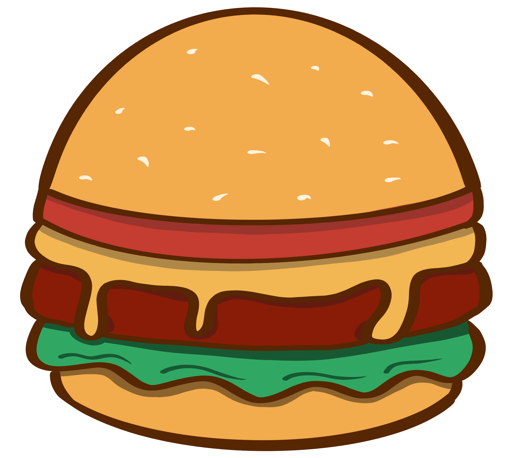
</p>

The application consists of calculating the amount of ingredients you should buy to avoid food waste.
It is a project carried out by two Spanish girls, an Icelandic boy and a Danish girl, during the project module. We are Nadia and Eva (Spain), Rashidi (Iceland) and Senait (Denmark).

## Technology Stack 

## Database

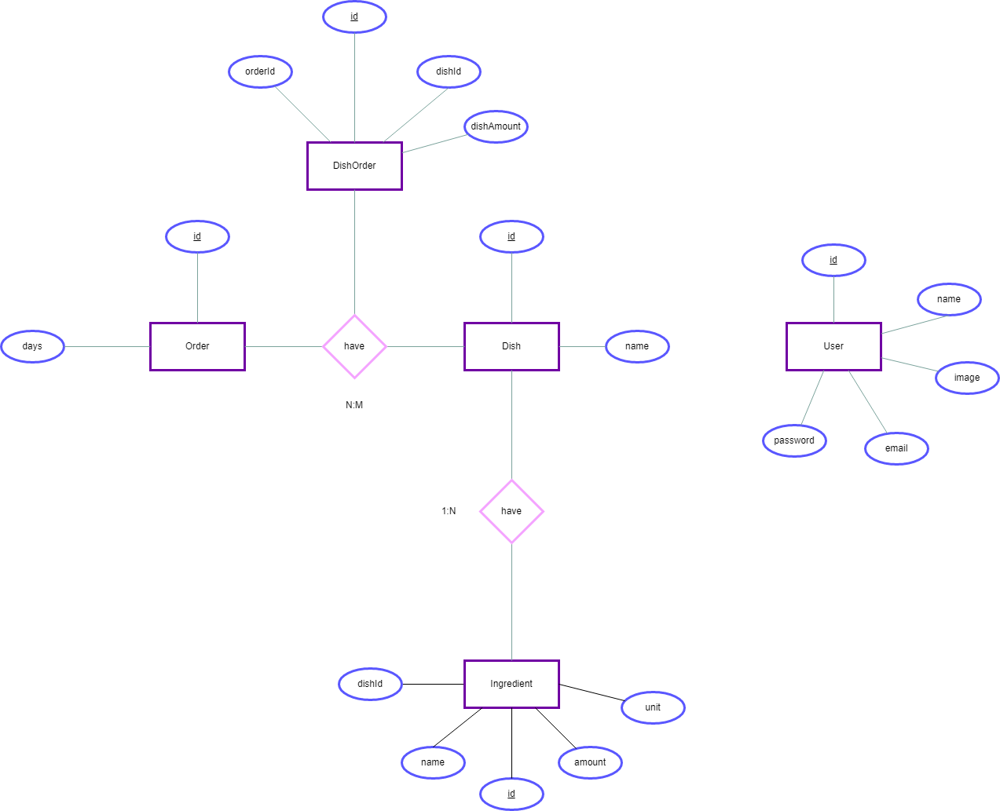
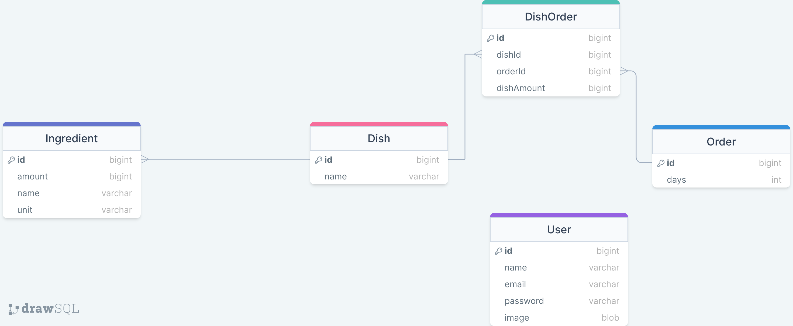
We have set it up in such a way that we have a user who adds the dishes and orders but is not linked to them, he simply does the action.

Then we have the dishes that have ingredients inside with the amount of each ingredient needed for each dish.

And finally we have an order in which we store the quantity of the dish we are going to order.

## Prototype and Mockup

[See on Figma](https://www.figma.com/file/rN4FQyZgl0tJy8hxuMCu3A/Restaurant-Manage?node-id=0%3A1&t=JINppABec3hiLXl9-1)

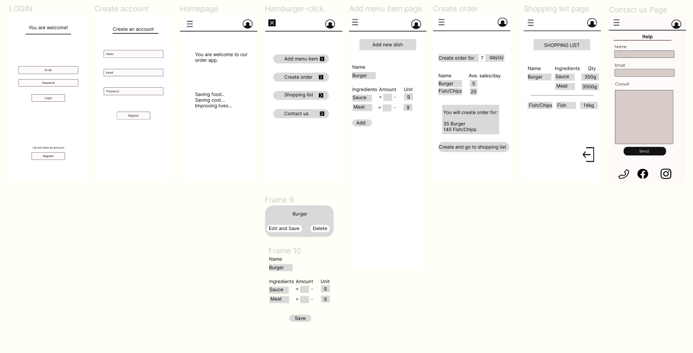
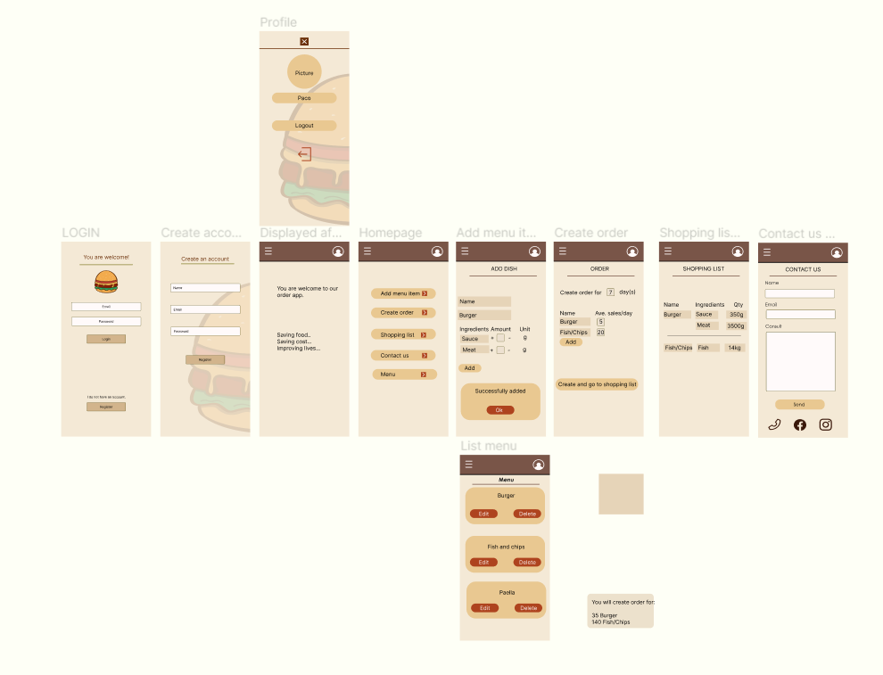

## Color palette

<p align="center" >
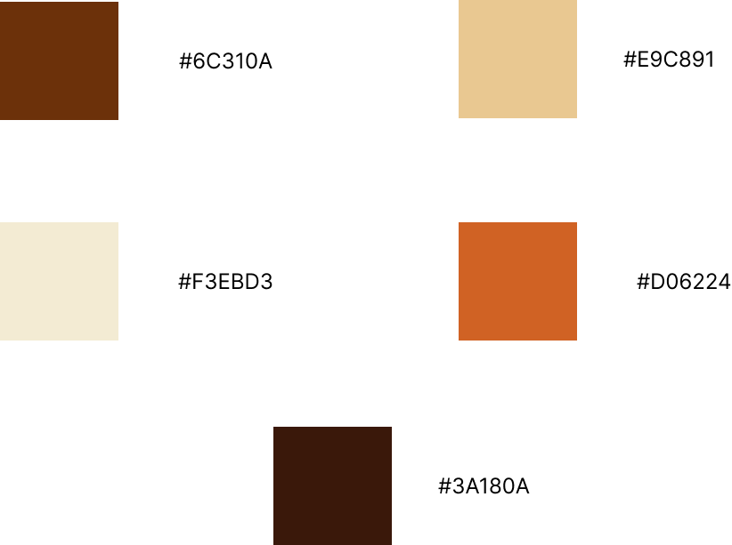
</p>

We chose this color palette because it is a reference to food and at the same time it combines well with the chosen logo.

## Planning

### Week 1

We started doing the design sprint, analyzing the problem, which was food waste, and what we wanted to do to solve it, we also conducted interviews to obtain more detailed information from professionals on the subject.

Then we make diagrams as follows:

-Empathy Map
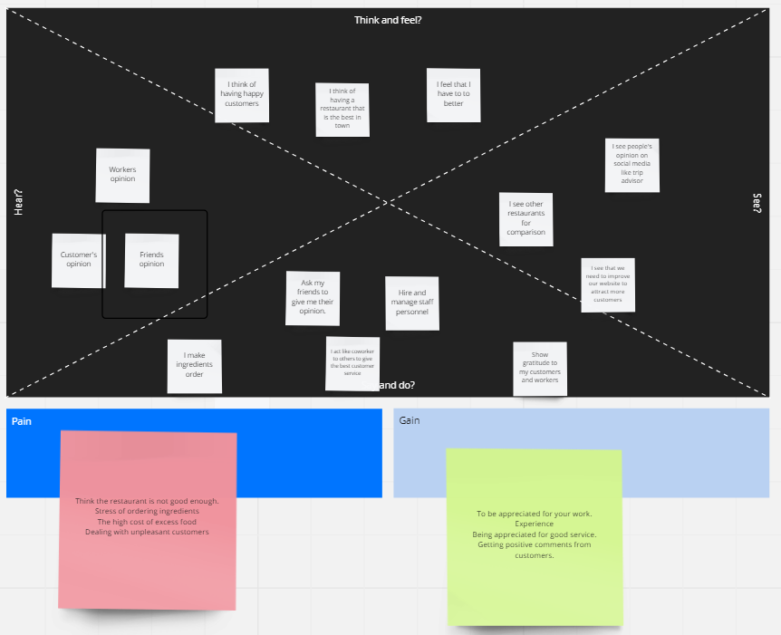

-User Persona
- Purpose

- Persona
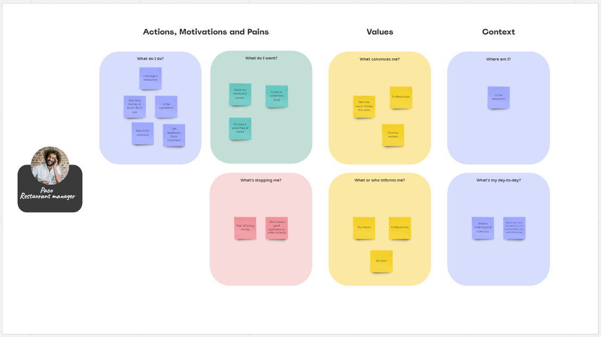
- Whats now?
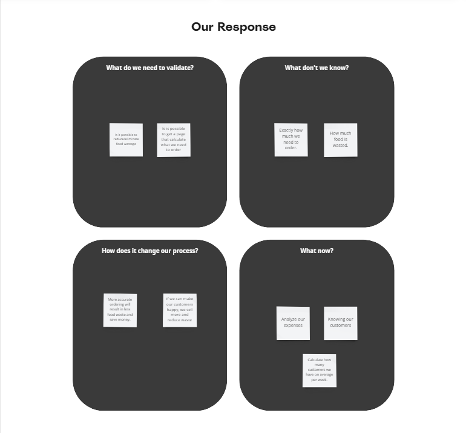

-Journey Map
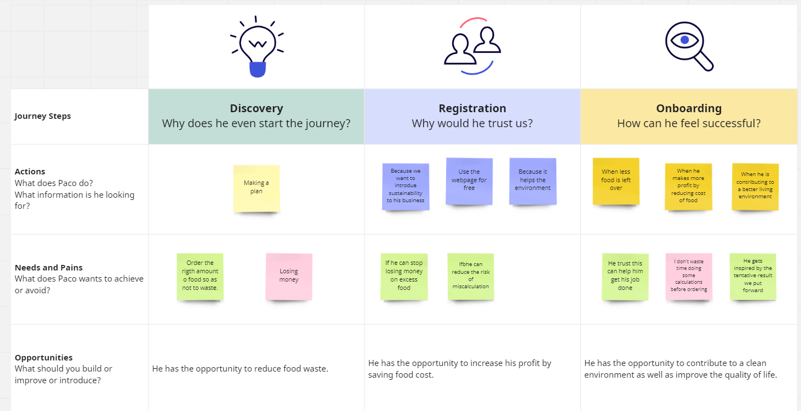

-Scenarios
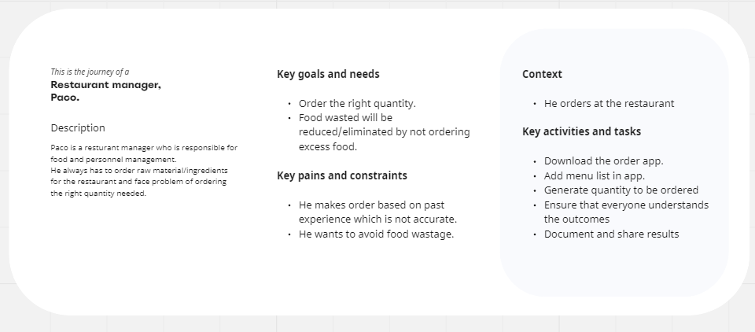
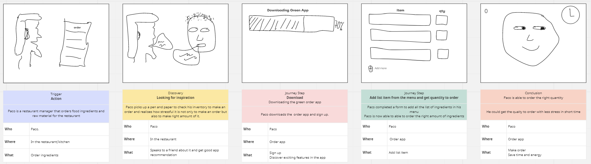

-How Might We?


-Crazy 8's
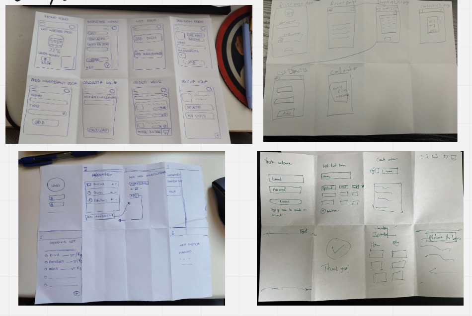

Then we chose the palette we were going to use, the final prototype and its components and fonts.

## Week 2

We start programming the backend and the frontend aesthetics.

## Week 3

We made the services and connected backend with frontend.

# Division of tasks (planning with Trello)

Eva: 
- Frontend Services
    - Add dish service
    - Auth header
    - Auth service
    - Http common
    - Ingredient service
- Add menu page
- Profile page
- Login page

Nadia:
- Entire backend: 
    - Controllers
    - Models
    - Routes
    - Image upload
    - Authentification
- Frontend header
- Order calculated with backend
- Shopping list calculated with backend
- Readme
- Diagrams
- Postman documentation
- Backend hosting
- Frontend hosting
- DB hosting

Rashidi: 
- Create order page
- Home page
- Shopping list page

Senait: 
- Contact page

# Installation and start

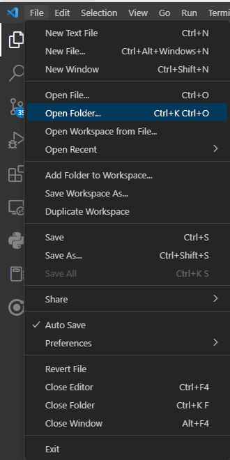 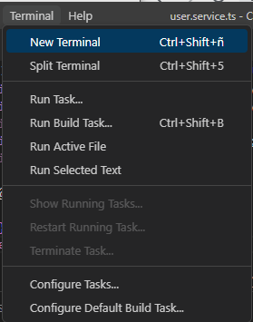

```bash 
cd YOUR FOLDER
git clone https://github.com/NadiaVg/Order-App.git 
```


```bash 
cd order-app/backend
npm i
```
Create the .env file

```javascript
JWT_SECRET=

MYSQL_DATABASE=order_db
MYSQL_USER=
MYSQL_PASSWORD=
MYSQL_ROOT_PASSWORD=

DB_HOST=localhost

NODE_ENV=development
```

``` bash
node index.js
```


```bash 
cd order-app/frontend
npm i
npm start
```

# Documentation

[POSTMAN](https://documenter.getpostman.com/view/17513635/2s93Jus2bh)

[OLD REPO](https://github.com/Senu14/Order-app.git)
